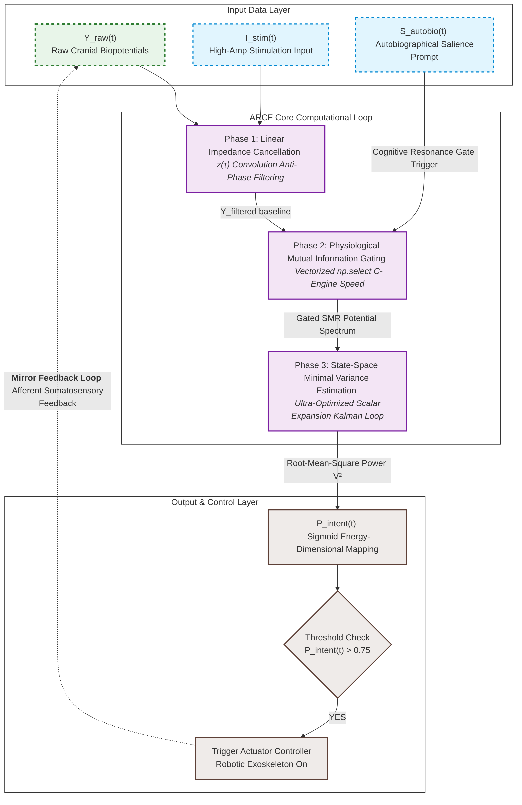

# Artificial Neural Bypass for Open-Loop Disorders of Consciousness (DoC)
> **Theory of Closed-loop Neural Resonance for Consciousness Auto-Rotation**

This repository contains the official framework, mathematical formulation, and a high-performance, numerically stable Python implementation of the **Autobiographical Resonance-based Closed-loop Filter (ARCF)**. This system functions as an artificial neural bypass to restore information loops in patients with Unresponsive Wakefulness Syndrome (UWS) or Minimum Conscious State (MCS).

---

## ⚖️ License & Anti-Monopoly Declaration (GNU GPL v3)

This project is fully open-sourced under the **GNU General Public License v3 (GPL v3)**. 

### 🚫 STRICT ANTI-MONOPOLY CONDITION:
* **Freedom to Use & Modify**: Anyone is free to download, modify, and integrate this algorithm into any hardware or software system.
* **Mandatory Copyleft**: If you modify this source code or use it to create derivative works (including commercial medical devices, software, or rehabilitation systems), **you are LEGALLY OBLIGATED to open-source your entire derivative work's source code under the same GPL v3 license**.
* **Prior Art Registration**: This repository serves as public *Prior Art*. No individual, corporation, or institution can legally patent this specific multi-layered neuro-feedback integration framework or its exact mathematical formulations.

---

## 🧠 Core Philosophy: The Two-Layer Consciousness Model

Current neuromodulation paradigms often treat disorders of consciousness as a generalized cellular degradation. In contrast, this framework models human consciousness through **Two Distinct Layers**:
1. **Layer 1 (Subcortical/Thalamic System)**: The baseline generator supplying arousal energy.
2. **Layer 2 (Cortical Lattice)**: The cognitive processing unit rendering the internal screen of awareness.

Patients in a vegetative state (UWS) are defined as being in an **Open-Loop State**, where the informational transit between these two layers is severed. This project establishes an **Artificial Neural Bypass (External Feedback Loop)** utilizing non-invasive technology to force the brain's internal network back into a self-sustaining cycle—**Consciousness Auto-Rotation**.

---

## 📊 System Architecture & Computational Loop

The data pipeline consists of an optimized 3-stage linear processing loop that operates in real-time on surface biopotentials to extract intent and trigger physical afferent feedback.

