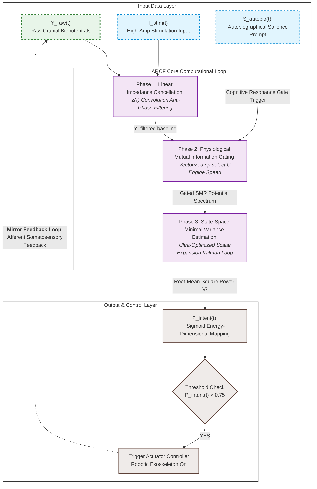

# Artificial Neural Bypass for Open-Loop Disorders of Consciousness (DoC)
> **Theory of Closed-loop Neural Resonance for Consciousness Auto-Rotation**

This repository contains the official framework, mathematical formulation, and a high-performance, numerically stable Python implementation of the **Autobiographical Resonance-based Closed-loop Filter (ARCF)**. This system functions as an artificial neural bypass to restore information loops in patients with Unresponsive Wakefulness Syndrome (UWS) or Minimum Conscious State (MCS).

---

## ⚖️ License & Anti-Monopoly Declaration (GNU GPL v3)

This project is fully open-sourced under the **GNU General Public License v3 (GPL v3)**. 

### 🚫 STRICT ANTI-MONOPOLY CONDITION:
* **Freedom to Use & Modify**: Anyone is free to download, modify, and integrate this algorithm into any hardware or software system.
* **Mandatory Copyleft**: If you modify this source code or use it to create derivative works (including commercial medical devices, software, or rehabilitation systems), **you are LEGALLY OBLIGATED to open-source your entire derivative work's source code under the same GPL v3 license**.
* **Prior Art Registration**: This repository serves as public *Prior Art*. No individual, corporation, or institution can legally patent this specific multi-layered neuro-feedback integration framework or its exact mathematical formulations.

---

## 🧠 Core Philosophy: The Two-Layer Consciousness Model

Current neuromodulation paradigms often treat disorders of consciousness as a generalized cellular degradation. In contrast, this framework models human consciousness through **Two Distinct Layers**:
1. **Layer 1 (Subcortical/Thalamic System)**: The baseline generator supplying arousal energy.
2. **Layer 2 (Cortical Lattice)**: The cognitive processing unit rendering the internal screen of awareness.

Patients in a vegetative state (UWS) are defined as being in an **Open-Loop State**, where the informational transit between these two layers is severed. This project establishes an **Artificial Neural Bypass (External Feedback Loop)** utilizing non-invasive technology to force the brain's internal network back into a self-sustaining cycle—**Consciousness Auto-Rotation**.

---

## 📊 System Architecture & Computational Loop

The data pipeline consists of an optimized 3-stage linear processing loop that operates in real-time on surface biopotentials to extract intent and trigger physical afferent feedback.
---

## ⚙️ 수학적 공식화 및 수치적 안정성 (Mathematical Formulations)

이 구현은 비선형 상호 정보 게이트가 추가된 2상태 선형 모델을 활용하는 최적화된 자서전적 공명 기반 폐루프 필터(ARCF)를 특징으로 합니다. 처리 코어는 공분산 행렬 붕괴에 대한 완벽한 보호 기능을 통해 **Numba JIT 컴파일 환경**에서 결정론적 성능을 보장합니다.

### 1. 1단계: 실시간 신호 조절 (Signal Conditioning)
고Q 무한 임펄스 응답(IIR) 노치 필터를 통해 원시 생체 전위($Y_{\text{raw}}$)에서 60Hz 전력선 아티팩트를 1차적으로 제거합니다:
$$Y_{\text{ccl}}[k] = \mathcal{L}_{\text{notch}}(Y_{\text{raw}}[k])$$

### 2. 2단계: 생리적 상호 정보 게이팅 (Information Gating)
인라인 인과적 게이팅 메커니즘은 모션 아티팩트 또는 기준선 드리프트로 인한 정보 포화를 방지하기 위해 조건화된 신호를 스케일링하여 절대적인 실시간 인과성을 보장합니다.
$$W_{\text{gate}}[k] = \max\left(0.1, \text{GatingSchedule}(t) + \eta[k]\right), \quad \eta \sim \mathcal{N}(0, \sigma^2)$$
$$Y_{\text{filt}}[k] = Y_{\text{ccl}}[k] \cdot W_{\text{gate}}[k]$$

### 3. 3단계: 상태 공간 최소 분산 추정 (Safe-Kalman Core)
심하게 오염된 입력에서 발생하는 잠재적인 10Hz 공진($X_{\text{brain}}$)을 추적하기 위해 필터는 이산 상태 공간 공식을 실행합니다. 여기서 $\theta = 2\pi f \Delta t$ 입니다:

* **예측 단계 (Prediction Step):**
$$\mathbf{x}_{k\vert{}k-1} = \begin{bmatrix} \cos\theta & -\sin\theta \\ \sin\theta & \cos\theta \end{bmatrix} \mathbf{x}_{k-1\vert{}k-1}$$
$$\mathbf{P}_{k\vert{}k-1} = \mathbf{A}\mathbf{P}_{k-1\vert{}k-1}\mathbf{A}^T + \mathbf{Q}$$

* **조셉 형식 공분산 업데이트 (Joseph Form Covariance Update):**
임베디드 에지 단정밀도 부동 소수점 환경에서 엄격한 양정치성과 수치 대칭성을 보장하기 위해, 공분산 업데이트는 조셉 형식($M = I - KH, \ H=\begin{bmatrix}1 & 0\end{bmatrix}$)의 대수적 스칼라 축소를 활용합니다:
$$m_0 = 1.0 - k_0$$
$$p_{00\_\text{new}} = m_0^2 \, p_{00\_m} + k_0^2 \, R$$
$$p_{01\_\text{new}} = m_0 \, p_{01\_m} - m_0 \, k_1 \, p_{00\_m} + k_0 \, k_1 \, R$$
$$p_{11\_\text{new}} = p_{11\_m} - 2.0 \, k_1 \, p_{01\_m} + k_1^2 \, p_{00\_m} + k_1^2 \, R$$

* **영하 발산 방지 (Sub-zero Divergence Guard):**
혁신 공분산이 안전 임계값 아래로 떨어질 때 스펙트럼 경계 매핑 및 0으로 나누기 우회를 통해 실시간 강건성이 보장됩니다:
$$\text{if } (p_{00\_m} + R) \le 10^{-9} \implies \text{Skip Update Loop}$$
$$p_{00}, p_{11} \ge 10^{-14}, \quad |p_{01}| \le \sqrt{p_{00} \cdot p_{11}}$$

