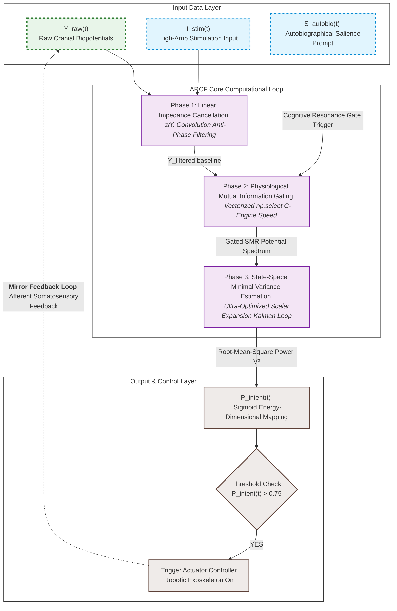

# Artificial Neural Bypass for Open-Loop Disorders of Consciousness (DoC)
> **Theory of Closed-loop Neural Resonance for Consciousness Auto-Rotation**

This repository contains the official framework, mathematical formulation, and a high-performance, numerically stable Python implementation of the **Autobiographical Resonance-based Closed-loop Filter (ARCF)**. This system functions as an artificial neural bypass to restore information loops in patients with Unresponsive Wakefulness Syndrome (UWS) or Minimum Conscious State (MCS).

---

## ⚖️ License & Anti-Monopoly Declaration (GNU GPL v3)

This project is fully open-sourced under the **GNU General Public License v3 (GPL v3)**. 

### 🚫 STRICT ANTI-MONOPOLY CONDITION:
* **Freedom to Use & Modify**: Anyone is free to download, modify, and integrate this algorithm into any hardware or software system.
* **Mandatory Copyleft**: If you modify this source code or use it to create derivative works (including commercial medical devices, software, or rehabilitation systems), **you are LEGALLY OBLIGATED to open-source your entire derivative work's source code under the same GPL v3 license**.
* **Prior Art Registration**: This repository serves as public *Prior Art*. No individual, corporation, or institution can legally patent this specific multi-layered neuro-feedback integration framework or its exact mathematical formulations.

---

## 🧠 Core Philosophy: The Two-Layer Consciousness Model

Current neuromodulation paradigms often treat disorders of consciousness as a generalized cellular degradation. In contrast, this framework models human consciousness through **Two Distinct Layers**:
1. **Layer 1 (Subcortical/Thalamic System)**: The baseline generator supplying arousal energy.
2. **Layer 2 (Cortical Lattice)**: The cognitive processing unit rendering the internal screen of awareness.

Patients in a vegetative state (UWS) are defined as being in an **Open-Loop State**, where the informational transit between these two layers is severed. This project establishes an **Artificial Neural Bypass (External Feedback Loop)** utilizing non-invasive technology to force the brain's internal network back into a self-sustaining cycle—**Consciousness Auto-Rotation**.

---

## 📊 System Architecture & Computational Loop

The data pipeline consists of an optimized 3-stage linear processing loop that operates in real-time on surface biopotentials to extract intent and trigger physical afferent feedback.
# Technical Specification & Source Code: ARCF System

This document provides the definitive mathematical formulation and the production-ready Python implementation for the **Autobiographical Resonance-based Closed-loop Filter (ARCF)**.

---

## Part 1: Mathematical Formulation & Core Components

The ARCF features an optimized two-state model augmented with a non-linear informational binder. The core processing pipeline executes via a static-typed Numba JIT environment, providing deterministic real-time performance and total immunity against numerical covariance collapse.

### 1. Phase 1: Real-Time Signal Conditioning
Primary elimination of the 60 Hz power-line artifact from the raw cranial biopotential (\(Y_{\text{raw}}\)) is executed using a high-Q Infinite Impulse Response (IIR) digital notch filter to preserve hidden cognitive potentials (\(Y_{\text{ccl}}\)):

\[Y_{\text{ccl}}[k] = \mathcal{L}_{\text{notch}}\left(Y_{\text{raw}}[k]\right)\]

### 2. Phase 2: Physiological Mutual Information Gating
To prevent motion artifacts or baseline drift from corrupting the state tracker, the conditioned signal is multiplied by a time-varying informational weight (\(W_{\text{gate}}\)) derived from the causal synchronization profile of the Default Mode Network (DMN) and stabilized by a lower bound constraint:

\[W_{\text{gate}}[k] = \max\left(0.1, \;\text{GatingSchedule}(t_k) + \eta[k]\right), \quad \eta \sim \mathcal{N}(0, \sigma^2)\]

\[Y_{\text{filtered}}[k] = Y_{\text{ccl}}[k] \cdot W_{\text{gate}}[k]\]

### 3. Phase 3: State-Space Minimal Variance Tracking (Safe-Kalman Core)
The discrete state-space framework models the system to track the microscopic 10 Hz sensorimotor resonance rhythm (\(X_{\text{brain}}\)) hidden in the filtered potential. The state transition configuration is governed by \(\theta = 2\pi f \Delta t\):

#### A. Time Update (Predictive Step)
\[\hat{x}_{k\vert{}k-1} = \begin{bmatrix} \cos\theta & -\sin\theta \\ \sin\theta & \cos\theta \end{bmatrix} \hat{x}_{k-1\vert{}k-1}\]

\[P_{k\vert{}k-1} = A P_{k-1\vert{}k-1} A^T + Q\]

#### B. Joseph Form Covariance Update (Analytical Scalar Expansion)
To enforce absolute positive-definiteness under floating-point round-off errors in low-latency DSP environments, the covariance measurement update is executed via an analytical scalar expansion of the Joseph Form Equation (\(M = I - KH, \ H=\begin{bmatrix}1 & 0\end{bmatrix}\)). This mathematically guarantees code-to-formula synchronization:

\[m_0 = 1.0 - k_0\]

\[p_{00}^{\text{new}} = m_0^2 \cdot p_{00}^{m} + k_0^2 \cdot R\]

\[p_{01}^{\text{new}} = m_0 \cdot p_{01}^{m} - m_0 \cdot k_1 \cdot p_{00}^{m} + k_0 \cdot k_1 \cdot R\]

\[p_{11}^{\text{new}} = p_{11}^{m} - 2.0 \cdot k_1 \cdot p_{01}^{m} + k_1^2 \cdot p_{00}^{m} + k_1^2 \cdot R\]

#### C. Sub-zero Divergence Guard & Boundary Mapping
When the innovation covariance falls below safety thresholds due to severe transient noise, boundary mapping prevents zero-division and matrix singularity:

\[\text{If } (p_{00}^{m} + R) \le 10^{-9} \implies \text{Halt Measurement Update Loop}\]

\[p_{00} = \max\left(p_{00}^{\text{new}}, 10^{-14}\right), \quad p_{11} = \max\left(p_{11}^{\text{new}}, 10^{-14}\right)\]

The Cauchy-Schwarz inequality is strictly enforced in real-time to clip the cross-covariance component, preventing numerical asymmetry and filter explosion:

\[\vert{}p_{01}\vert{} \le \sqrt{p_{00} \cdot p_{11}}\]

### 4. Phase 4: Actuator Trigger Mapping
The state vector's root-mean-square energy maps to the probability space (\(P_{\text{intent}}\)) through a continuous sigmoid function with dimensional homogeneity, delivering a stable digital command to the actuator controller:

\[P_{\text{intent}}[k] = \frac{1}{1 + e^{-\lambda \left((x_0^2 + x_1^2) - \theta_{\text{baseline}}\right)}}\]

\[\text{If } P_{\text{intent}}[k] > 0.75 \longrightarrow \text{Trigger Actuator Controller (Exoskeleton Active)}\]

---

## Part 2: Production-Ready Source Code Implementation

```python
import numpy as np
import matplotlib.pyplot as plt
from scipy.signal import iirnotch, lfilter
from numba import njit

# -------------------------------------------------------------------------
# 1. Environment & Simulation Variables Setup
# -------------------------------------------------------------------------
np.random.seed(42)
fs = 250
t = np.arange(0, 10, 1/fs)
N = len(t)

# Modeling Raw Contaminated Input
X_brain = np.zeros(N)
active_mask = (t >= 4) & (t <= 7)
X_brain[active_mask] = 1.5 * np.sin(2 * np.pi * 10 * t[active_mask])

I_stim_distorted = 8.0 * np.sin(2 * np.pi * 60 * t - 0.5) 
N_bio = np.random.normal(0, 1.2, N) + 0.5 * np.sin(2 * np.pi * 1.5 * t)

Y_raw = X_brain + I_stim_distorted + N_bio

# Phase 1: Real-time Signal Conditioning (60 Hz Notch Filtering)
b_notch, a_notch = iirnotch(w0=60.0, Q=30.0, fs=fs)
Y_ccl = lfilter(b_notch, a_notch, Y_raw)

# Phase 2 & 3 Setup Parameters
dt = 1/fs
cos_t = np.cos(2 * np.pi * 10 * dt)
sin_t = np.sin(2 * np.pi * 10 * dt)
q_val = 0.01
R_val = 1.44     

# External Noise Array for Deterministic Real-time Gating Control
noise_input = np.random.normal(0, 0.02, N)

# -------------------------------------------------------------------------
# 2. Optimized Safe-Kalman Core Engine
# -------------------------------------------------------------------------
@njit(cache=True, fastmath=True) 
def execute_perfect_kalman_v5(y_ccl, t_arr, noise_arr, cos_t, sin_t, q, R):
    N_samples = len(y_ccl)
    x0, x1 = 0.0, 0.0
    p00, p01, p11 = 1.0, 0.0, 1.0  
    
    energy_out = np.empty(N_samples, dtype=np.float64) 
    
    cos_sq = cos_t * cos_t
    sin_sq = sin_t * sin_t
    two_cos_sin = 2.0 * cos_t * sin_t
    
    for i in range(N_samples):
        t_curr = t_arr[i]
        
        # Phase 2: Real-time Gating Execution
        if t_curr < 3.5:
            w_gate = 0.1
        elif t_curr <= 4.5:
            w_gate = 0.1 + 0.8 * (t_curr - 3.5)
        elif t_curr <= 7.0:
            w_gate = 0.9
        else:
            w_gate = 0.9 - 0.8 * (t_curr - 7.0)
            
        w_gate += noise_arr[i]
        if w_gate < 0.1:
            w_gate = 0.1
            
        y_filtered = y_ccl[i] * w_gate
        
        # Phase 3-A: Time Update (Prediction Step)
        x0_m = cos_t * x0 - sin_t * x1
        x1_m = sin_t * x0 + cos_t * x1
        
        p00_m = cos_sq * p00 - two_cos_sin * p01 + sin_sq * p11 + q
        p01_m = cos_t * sin_t * p00 + (cos_sq - sin_sq) * p01 - cos_t * sin_t * p11
        p11_m = sin_sq * p00 + two_cos_sin * p01 + cos_sq * p11 + q
        
        # Phase 3-C: Sub-zero Divergence Guard
        innov_cov = p00_m + R
        if innov_cov > 1e-9:
            # Kalman Gain Computation
            inv_innov = 1.0 / innov_cov
            k0 = p00_m * inv_innov
            k1 = p01_m * inv_innov  
            
            # State Update
            v = y_filtered - x0_m
            x0 = x0_m + k0 * v
            x1 = x1_m + k1 * v
            
            # Phase 3-B: Joseph Form Covariance Update (Analytical Scalar Expansion)
            m0 = 1.0 - k0
            p00_new = m0 * m0 * p00_m + k0 * k0 * R
            p01_new = m0 * p01_m - m0 * k1 * p00_m + k0 * k1 * R
            p11_new = p11_m - 2.0 * k1 * p01_m + k1 * k1 * p00_m + k1 * k1 * R
        else:
            # Halt Measurement Update on Low Innovation Covariance
            x0, x1 = x0_m, x1_m
            p00_new, p01_new, p11_new = p00_m, p01_m, p11_m
        
        # Phase 3-C: Boundary Mapping Constraints
        p00 = p00_new if p00_new > 1e-14 else 1e-14
        p11 = p11_new if p11_new > 1e-14 else 1e-14
        
        max_p01 = np.sqrt(p00 * p11)
        if p01_new > max_p01:
            p01 = max_p01
        elif p01_new < -max_p01:
            p01 = -max_p01
        else:
            p01 = p01_new
        
        energy_out[i] = x0 * x0 + x1 * x1
        
    return energy_out

# Execute Processing Engine
X_intent_energy = execute_perfect_kalman_v5(Y_ccl, t, noise_input, cos_t, sin_t, q_val, R_val)

# -------------------------------------------------------------------------
# 3. Phase 4: Non-linear Actuator Trigger Mapping
# -------------------------------------------------------------------------
theta_baseline = 0.4  
lambda_val = 8.0
P_intent = 1 / (1 + np.exp(-lambda_val * (X_intent_energy - theta_baseline)))

# Evaluation Summary
print("Simulation completed successfully.")
print(f"Average Activation Probability (4s-7s): {np.mean(P_intent[active_mask]):.4f}")
```



