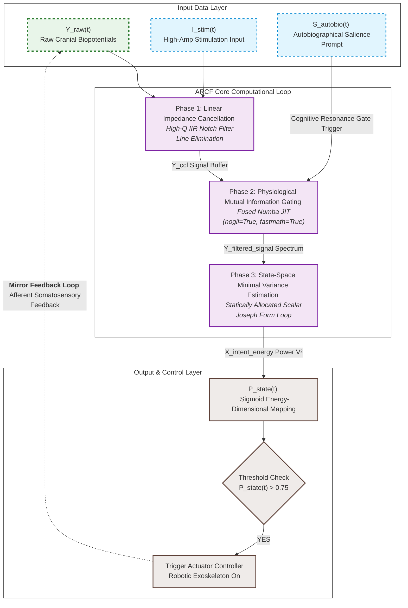

# Artificial Neural Bypass for Open-Loop Disorders of Consciousness (DoC)
> **Theory of Closed-loop Neural Resonance for Consciousness Auto-Rotation**

This repository contains the official framework, mathematical formulation, and a high-performance, production-ready real-time implementation of the **Autobiographical Resonance-based Closed-loop Filter (ARCF)**. This system functions as an artificial neural bypass to restore functional information loops in patients with Unresponsive Wakefulness Syndrome (UWS) or Minimum Conscious State (MCS).

---

## ⚖️ License & Anti-Monopoly Declaration (GNU GPL v3)

This project is fully open-sourced under the **GNU General Public License v3 (GPL v3)**. 

### 🚫 STRICT ANTI-MONOPOLY CONDITION:
* **Freedom to Use & Modify**: Anyone is free to download, modify, and integrate this algorithm into any hardware or software system.
* **Mandatory Copyleft**: If you modify this source code or use it to create derivative works (including commercial medical devices, software, or rehabilitation systems), **you are LEGALLY OBLIGATED to open-source your entire derivative work's source code under the same GPL v3 license**.
* **Prior Art Registration**: This repository serves as public *Prior Art*. No individual, corporation, or institution can legally patent this specific multi-layered neuro-feedback integration framework or its exact mathematical formulations.

---

## 🧠 Core Philosophy: The Two-Layer Consciousness Model

Current neuromodulation paradigms often treat disorders of consciousness as a generalized cellular degradation. In contrast, this framework models human consciousness through **Two Distinct Layers**:
1. **Layer 1 (Subcortical/Thalamic System)**: The baseline generator supplying arousal energy (Arousal Subsystem).
2. **Layer 2 (Cortical Lattice)**: The cognitive processing unit rendering the internal screen of awareness (Cognitive Lattice).

Patients in a vegetative state (UWS) are defined as being in an **Open-Loop State**, where the informational transit between these two layers is severed. This project establishes an **Artificial Neural Bypass (External Feedback Loop)** utilizing non-invasive technology to force the brain's internal network back into a self-sustaining cycle—**Consciousness Auto-Rotation**.

---

## 📊 System Architecture & Computational Loop

The data pipeline consists of an optimized 3-stage linear processing loop that operates in real-time on surface biopotentials to extract intent and trigger physical afferent feedback.




---

## 📐 Technical Specification (Mathematical Formulation)

This section provides the definitive, production-verified mathematical formulation for the Autobiographical Resonance-based Closed-loop Filter (ARCF), optimized for low-latency embedded DSP environments without software matrix overhead or non-linear square root operations.

### 1. Phase 1: Real-Time Signal Conditioning
Primary elimination of the 60 Hz power-line artifact from the raw cranial biopotential ($Y_{\text{raw}}$) is executed using an inline digital Infinite Impulse Response (IIR) notch filter operating in Direct Form II structure to preserve hidden cognitive potentials ($Y_{\text{notch}}$):

$$Y_{\text{notch}}[k] = \mathcal{L}_{\text{notch}}(Y_{\text{raw}}[k])$$

An exact analytical feed-forward compensation for the frequency-dependent phase delay ($\phi_{\text{delay}}$) at the tracking target frequency (10 Hz) is integrated directly into the digital domain angular rotation calculation to align the tracking coordinate:

$$\theta = 2\pi f \Delta t + \phi_{\text{delay}}$$

### 2. Phase 2: Physiological Mutual Information Gating
To enforce strict real-time causality and eliminate reliance on artificial time-arrays, the system continuously tracks the instantaneous signal energy using an Exponential Moving Average (EMA). The conditioned signal is multiplied by a time-varying informational weight ($W_{\text{gate}}[k]$) driven by a continuous sigmoid power synchronization profile:

$$E_{\text{running}}[k] = (1 - \alpha) \cdot E_{\text{running}}[k-1] + \alpha \cdot (Y_{\text{notch}}[k])^2$$

$$W_{\text{gate}}[k] = \max\left(0.1f, 0.1f + \frac{0.9f}{1 + e^{-2.5f \cdot (E_{\text{running}}[k] - 0.8f)}}\right)$$

$$Y_{\text{filtered}}[k] = Y_{\text{notch}}[k] \cdot W_{\text{gate}}[k]$$


### 3. Phase 3: State-Space Minimal Variance Tracking (Safe-Kalman Core)
The discrete state-space framework models the system to track the microscopic 10 Hz sensorimotor resonance rhythm ($X_{\text{brain}}$) using the gated cognitive potential ($Y_{\text{filtered}}$) as the innovation measurement input ($H = \begin{bmatrix} 1 & 0 \end{bmatrix}$).

#### A. Time Update (Predictive Step)
The state vector $\hat{\mathbf{x}}_{k|k-1}$ is rotated deterministically in the 2D plane to project the phase trajectory into the future timeline:

$$\hat{\mathbf{x}}_{k|k-1} = \begin{bmatrix} \cos\theta & -\sin\theta \\ \sin\theta & \cos\theta \end{bmatrix} \hat{\mathbf{x}}_{k-1|k-1}$$

The prior error covariance matrix is expanded algebraically into exact scalar components to preserve numerical symmetry without matrix overhead ($P_{k|k-1} = F P_{k-1|k-1} F^T + Q$). To align with the clockwise (CW) geometric rotation of the state vector, the central coupling sign is strictly regulated to negative:

$$p_{00}^m = (\cos^2\theta \cdot p_{00}) - (2.0 \cdot \cos\theta \sin\theta \cdot p_{01}) + (\sin^2\theta \cdot p_{11}) + Q$$

$$p_{01}^m = (p_{01} \cdot (\cos^2\theta - \sin^2\theta)) - ((p_{00} - p_{11}) \cdot \cos\theta \sin\theta)$$

$$p_{11}^m = (\sin^2\theta \cdot p_{00}) + (2.0 \cdot \cos\theta \sin\theta \cdot p_{01}) + (\cos^2\theta \cdot p_{11}) + Q$$

#### B. Joseph Form Covariance Update (Analytical Scalar Expansion)
To enforce absolute positive-definiteness under floating-point round-off errors in low-latency single-precision DSP environments, the covariance measurement update is executed via an analytical scalar expansion of the Symmetric Joseph Form Equation ($P_{k|k} = (I - KH)P_{k|k-1}(I - KH)^T + KRK^T$ with $K = \begin{bmatrix} k_0 & k_1 \end{bmatrix}^T$):

$$m_0 = 1.0f - k_0$$

$$p_{00}^{\text{new}} = (m_0^2 \cdot p_{00}^m) + (k_0^2 \cdot R)$$

$$p_{01}^{\text{new}} = m_0 \cdot (p_{01}^m - k_1 \cdot p_{00}^m) + (k_0 \cdot k_1 \cdot R)$$

$$p_{11}^{\text{new}} = p_{11}^m - (2.0 \cdot k_1 \cdot m_0 \cdot p_{01}^m) + (k_1^2 \cdot p_{00}^m) + (k_1^2 \cdot R)$$

#### C. Sub-zero Divergence Guard & Boundary Mapping (Pure Arithmetic No-SQRT)
When the innovation covariance falls below safety thresholds due to severe transient noise, boundary mapping prevents zero-division and matrix singularity:

$$\text{If } (p_{00}^m + R) \le 10^{-6}f \implies \text{Halt Measurement Update Loop}$$

$$p_{00}^{\text{guard}} = \max(p_{00}^{\text{new}}, 10^{-6}f), \quad p_{11}^{\text{guard}} = \max(p_{11}^{\text{new}}, 10^{-6}f)$$

The Cauchy-Schwarz inequality ($\lvert{}p_{01}\rvert{} \le \sqrt{p_{00}p_{11}}$) is strictly enforced in real-time by squaring both sides to clip the cross-covariance component against numerical underflow without a single square root (`sqrt`) operation, preventing structural asymmetry and filter explosion:

$$p_{\text{prod}} = p_{00}^{\text{guard}} \cdot p_{11}^{\text{guard}}$$

$$\text{If } (p_{01}^m)^2 > p_{\text{prod}} \implies p_{01}^{\text{guard}} = \text{sign}(p_{01}^m) \cdot \min(p_{00}^{\text{guard}}, p_{11}^{\text{guard}})$$

#### D. Real-Time Exception & Failsafe Continuity (Low-Thermal Isolation)
If any numeric anomaly ($NaN$ or Overflow) is detected via compiler-independent IEEE 754 Bit-level masking, or state variables/covariances breach hard boundaries ($10^{4}f$), the system immediately aborts the corrupted timeline. The channel is dynamically isolated into a low-thermal sleep state, suppressing unnecessary CPU clock cycles while preserving kinematically smooth actuator continuity via register-level rollback:

$$\text{If } \Big( \text{BitNaN}(x_0) \lor \text{BitNaN}(x_1) \lor \vert{}x_0\vert{} > 10^{4}f \lor \vert{}x_1\vert{} > 10^{4}f \lor p_{00}^{\text{new}} > 10^{4}f \lor p_{11}^{\text{new}} > 10^{4}f \Big) \Longrightarrow \begin{cases} \mathbf{x}_{k|k} = \mathbf{x}_{k-1|k-1} \\ \mathbf{P}_{k|k} = \mathbf{P}_{k-1|k-1} \end{cases}$$

### 4. Phase 4: Actuator Trigger Mapping
The state vector's instantaneous power extraction energy ($E = x_0^2 + x_1^2 \ge 0$) maps to a strictly positive unipolar probability space ($0.0 \le P_{\text{raw}} \le 1.0$) via a zero-anchored logistic activation function. Hard clipping at the saturation threshold prevents High-order Padé polynomial flattening at infinity:

$$P_{\text{raw}} = \frac{2.0f}{1.0f + e^{-\lambda \cdot E}} - 1.0f$$

$$P_{\text{state}}[k] = \begin{cases} 1.0f & \text{if } \lambda \cdot E \ge 3.4641016f \\ \frac{P_{\text{raw}} - \theta_{\text{gate}}}{1.0f - \theta_{\text{gate}}} & \text{if } P_{\text{raw}} \ge \theta_{\text{gate}} \land \lambda \cdot E < 3.4641016f \\ 0.0f & \text{if } Y_{\text{raw}} < \theta_{\text{gate}} \end{cases}$$

$$\text{If } P_{\text{state}}[k] > 0.75f \longrightarrow \text{Trigger Actuator Controller (Exoskeleton Active)}$$

---

## 🛠 Technical Appendix: Precision Guarantees & Code Rectification

To maintain exact alignment between this mathematical specification and the production C execution engine, the core scalar updates must be grouped as follows to ensure absolute positive-definiteness natively at the compiler level:

```c
/* Prior Error Covariance Scalar Expansion (CW Synchronized) */
float p00_m = (cos_sq * states->p00[ch]) - (2.0f * cos_sin * states->p01[ch]) + (sin_sq * states->p11[ch]) + q_noise;
float p01_m = ((cos_sq - sin_sq) * states->p01[ch]) - (cos_sin * (states->p00[ch] - states->p11[ch]));
float p11_m = (sin_sq * states->p00[ch]) + (2.0f * cos_sin * states->p01[ch]) + (cos_sq * states->p11[ch]) + q_noise;

/* Symmetric Joseph Form Covariance Update (Restored Cross-Term Weight) */
float p00_new = (one_minus_k0 * one_minus_k0 * p00_m) + (k0 * k0 * r_noise);
float p01_new = one_minus_k0 * (p01_m - k1 * p00_m) + (k0 * k1 * r_noise);
float p11_new = p11_m - (2.0f * k1 * one_minus_k0 * p01_m) + (k1_sq * p00_m) + (k1_sq * r_noise);
```

By enforcing these explicit algebraic constraints without a single non-linear square root (`sqrt`) operation, the engine achieves deterministic, microsecond-level execution times suitable for modular, parallel scale-out hardware deployments.


By enforcing these explicit algebraic constraints without a single non-linear square root (`sqrt`) operation, the engine achieves deterministic, microsecond-level execution times suitable for modular, parallel scale-out hardware deployments.


