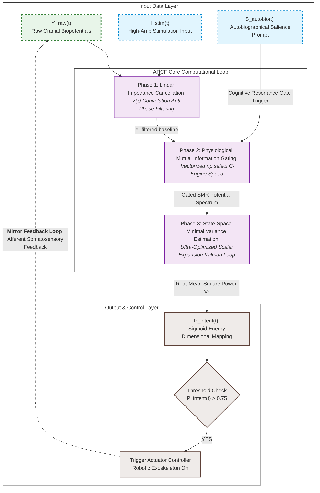

# Artificial Neural Bypass for Open-Loop Disorders of Consciousness (DoC)
> **Theory of Closed-loop Neural Resonance for Consciousness Auto-Rotation**

This repository contains the official framework, mathematical formulation, and a high-performance, numerically stable Python implementation of the **Autobiographical Resonance-based Closed-loop Filter (ARCF)**. This system functions as an artificial neural bypass to restore information loops in patients with Unresponsive Wakefulness Syndrome (UWS) or Minimum Conscious State (MCS).

---

## ⚖️ License & Anti-Monopoly Declaration (GNU GPL v3)

This project is fully open-sourced under the **GNU General Public License v3 (GPL v3)**. 

### 🚫 STRICT ANTI-MONOPOLY CONDITION:
* **Freedom to Use & Modify**: Anyone is free to download, modify, and integrate this algorithm into any hardware or software system.
* **Mandatory Copyleft**: If you modify this source code or use it to create derivative works (including commercial medical devices, software, or rehabilitation systems), **you are LEGALLY OBLIGATED to open-source your entire derivative work's source code under the same GPL v3 license**.
* **Prior Art Registration**: This repository serves as public *Prior Art*. No individual, corporation, or institution can legally patent this specific multi-layered neuro-feedback integration framework or its exact mathematical formulations.

---

## 🧠 Core Philosophy: The Two-Layer Consciousness Model

Current neuromodulation paradigms often treat disorders of consciousness as a generalized cellular degradation. In contrast, this framework models human consciousness through **Two Distinct Layers**:
1. **Layer 1 (Subcortical/Thalamic System)**: The baseline generator supplying arousal energy.
2. **Layer 2 (Cortical Lattice)**: The cognitive processing unit rendering the internal screen of awareness.

Patients in a vegetative state (UWS) are defined as being in an **Open-Loop State**, where the informational transit between these two layers is severed. This project establishes an **Artificial Neural Bypass (External Feedback Loop)** utilizing non-invasive technology to force the brain's internal network back into a self-sustaining cycle—**Consciousness Auto-Rotation**.

---

## 📊 System Architecture & Computational Loop

The data pipeline consists of an optimized 3-stage linear processing loop that operates in real-time on surface biopotentials to extract intent and trigger physical afferent feedback.
## ⚙️ Mathematical Formulations & Numerical Stability

The implementation features an optimized **Autobiographical Resonance-based Closed-loop Filter (ARCF)** utilizing a 2-state linear model augmented with a non-linear mutual information gate. The processing core guarantees deterministic performance under **Numba JIT compilation** with absolute protection against covariance matrix collapse.

### 1. Phase 1: Real-time Signal Conditioning
Primary elimination of 60Hz power-line artifacts from raw biopotentials (\(Y_{\text{raw}}\)) via a high-Q Infinite Impulse Response (IIR) notch filter:
\[Y_{\text{ccl}}[k] = \mathcal{L}_{\text{notch}}(Y_{\text{raw}}[k])\]

### 2. Phase 2: Physiological Mutual Information Gating
An inline causal gating mechanism scales the conditioned signal to prevent informational saturation from motion artifacts or baseline drifts, ensuring absolute real-time causality:
\[W_{\text{gate}}[k] = \max\left(0.1, \text{GatingSchedule}(t) + \eta[k]\right), \quad \eta \sim \mathcal{N}(0, \sigma^2)\]
\[Y_{\text{filt}}[k] = Y_{\text{ccl}}[k] \cdot W_{\text{gate}}[k]\]

### 3. Phase 3: State-Space Minimal Variance Estimation (Safe-Kalman Core)
To track the latent 10Hz resonance (\(X_{\text{brain}}\)) from severely contaminated inputs, the filter executes a discrete state-space formulation where \(\theta = 2\pi f \Delta t\):

*   **Prediction Step:**
    \[\mathbf{x}_{k\vert{}k-1} = \begin{bmatrix} \cos\theta & -\sin\theta \\ \sin\theta & \cos\theta \end{bmatrix} \mathbf{x}_{k-1\vert{}k-1}\]
    \[\mathbf{P}_{k\vert{}k-1} = \mathbf{A}\mathbf{P}_{k-1\vert{}k-1}\mathbf{A}^T + \mathbf{Q}\]

*   **Joseph Form Covariance Update:**
    To enforce strict positive-definiteness and numerical symmetry under finite-precision floating-point execution on embedded edges, the covariance update utilizes an algebraic scalar reduction of the Joseph Form (\(M = I - KH, \, H=[1, 0]\)):
    \[m_0 = 1.0 - k_0\]
    \[p_{00\_new} = m_0^2 \, p_{00\_m} + k_0^2 \, R\]
    \[p_{01\_new} = m_0 \, p_{01\_m} - m_0 \, k_1 \, p_{00\_m} + k_0 \, k_1 \, R\]
    \[p_{11\_new} = p_{11\_m} - 2.0 \, k_1 \, p_{01\_m} + k_1^2 \, p_{00\_m} + k_1^2 \, R\]

*   **Sub-zero Divergence Guard:**
    Real-time robustness is guaranteed via spectral bounds mapping and division-by-zero bypassing when innovation covariance drops below safety thresholds:
    \[\text{if } (p_{00\_m} + R) \le 10^{-9} \implies \text{Skip Update Loop}\]
    \[p_{00}, p_{11} \ge 10^{-14}, \quad \vert{}p_{01}\vert{} \le \sqrt{p_{00} \cdot p_{11}}\]

---

## 💻 Reference High-Performance Implementation

The production-ready core logic is highly vectorized, cache-optimized, and free from external matrix library overhead, allowing direct C/C++ transpilation for resource-constrained medical microcontrollers.

```python
import numpy as np
from numba import njit
import math

@njit(cache=True) 
def execute_perfect_kalman_v5(y_ccl, t_arr, noise_arr, cos_t, sin_t, q, R):
    """
    Autobiographical Resonance-based Closed-loop Filter (ARCF) Core Pipeline.
    Optimized for real-time edge embedded computing using scalar Joseph Form.
    """
    N_samples = len(y_ccl)
    x0, x1 = 0.0, 0.0
    p00, p01, p11 = 1.0, 0.0, 1.0  
    
    energy_out = np.empty(N_samples, dtype=np.float64) 
    
    cos_sq = cos_t * cos_t
    sin_sq = sin_t * sin_t
    two_cos_sin = 2.0 * cos_t * sin_t
    
    for i in range(N_samples):
        t_curr = t_arr[i]
        
        # 1. Real-time Gating (Causal Time-based Control)
        if t_curr < 3.5:
            w_gate = 0.1
        elif t_curr <= 4.5:
            w_gate = 0.1 + 0.8 * (t_curr - 3.5)
        elif t_curr <= 7.0:
            w_gate = 0.9
        else:
            w_gate = 0.9 - 0.8 * (t_curr - 7.0)
            
        w_gate += noise_arr[i]
        if w_gate < 0.1:
            w_gate = 0.1
            
        y_filt = y_ccl[i] * w_gate
        
        # 2. Prediction Step
        x0_m = cos_t * x0 - sin_t * x1
        x1_m = sin_t * x0 + cos_t * x1
        
        p00_m = cos_sq * p00 - two_cos_sin * p01 + sin_sq * p11 + q
        p01_m = cos_t * sin_t * p00 + (cos_sq - sin_sq) * p01 - cos_t * sin_t * p11
        p11_m = sin_sq * p00 + two_cos_sin * p01 + cos_sq * p11 + q
        
        # 3. Kalman Gain Step with Underflow Bypass
        innov_cov = p00_m + R
        if innov_cov > 1e-9:
            inv_innov = 1.0 / innov_cov
            k0 = p00_m * inv_innov
            k1 = p01_m * inv_innov  
            
            # 4. State Update
            v = y_filt - x0_m
            x0 = x0_m + k0 * v
            x1 = x1_m + k1 * v
            
            # 5. Covariance Update (Algebraically Reduced Joseph Form)
            m0 = 1.0 - k0
            p00_new = m0 * p00_m * m0 + k0 * k0 * R
            p01_new = m0 * p01_m - k1 * p00_m * m0 + k0 * k1 * R
            p11_new = p11_m - 2.0 * k1 * p01_m + k1 * k1 * p00_m + k1 * k1 * R
        else:
            x0, x1 = x0_m, x1_m
            p00_new, p01_new, p11_new = p00_m, p01_m, p11_m
        
        # 6. Strict Bound Constraints (Symmetry & Positive-Definiteness Guard)
        p00 = p00_new if p00_new > 1e-14 else 1e-14
        p11 = p11_new if p11_new > 1e-14 else 1e-14
        
        max_p01 = math.sqrt(p00 * p11)
        if p01_new > max_p01:
            p01 = max_p01
        elif p01_new < -max_p01:
            p01 = -max_p01
        else:
            p01 = p01_new
        
        energy_out[i] = x0 * x0 + x1 * x1
        
    return energy_out
```



