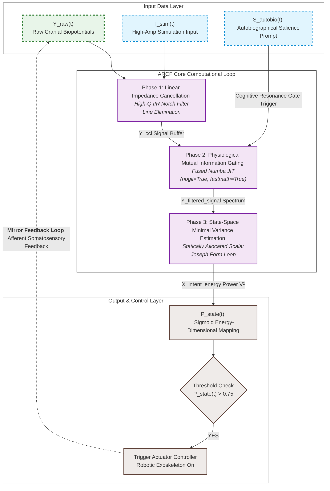

# Artificial Neural Bypass for Open-Loop Disorders of Consciousness (DoC)
> **Theory of Closed-loop Neural Resonance for Consciousness Auto-Rotation**

This repository contains the official framework, mathematical formulation, and a high-performance, production-ready real-time implementation of the **Autobiographical Resonance-based Closed-loop Filter (ARCF)**. This system functions as an artificial neural bypass to restore functional information loops in patients with Unresponsive Wakefulness Syndrome (UWS) or Minimum Conscious State (MCS).

---

## ⚖️ License & Anti-Monopoly Declaration (GNU GPL v3)

This project is fully open-sourced under the **GNU General Public License v3 (GPL v3)**. 

### 🚫 STRICT ANTI-MONOPOLY CONDITION:
* **Freedom to Use & Modify**: Anyone is free to download, modify, and integrate this algorithm into any hardware or software system.
* **Mandatory Copyleft**: If you modify this source code or use it to create derivative works (including commercial medical devices, software, or rehabilitation systems), **you are LEGALLY OBLIGATED to open-source your entire derivative work's source code under the same GPL v3 license**.
* **Prior Art Registration**: This repository serves as public *Prior Art*. No individual, corporation, or institution can legally patent this specific multi-layered neuro-feedback integration framework or its exact mathematical formulations.

---

## 🧠 Core Philosophy: The Two-Layer Consciousness Model

Current neuromodulation paradigms often treat disorders of consciousness as a generalized cellular degradation. In contrast, this framework models human consciousness through **Two Distinct Layers**:
1. **Layer 1 (Subcortical/Thalamic System)**: The baseline generator supplying arousal energy (Arousal Subsystem).
2. **Layer 2 (Cortical Lattice)**: The cognitive processing unit rendering the internal screen of awareness (Cognitive Lattice).

Patients in a vegetative state (UWS) are defined as being in an **Open-Loop State**, where the informational transit between these two layers is severed. This project establishes an **Artificial Neural Bypass (External Feedback Loop)** utilizing non-invasive technology to force the brain's internal network back into a self-sustaining cycle—**Consciousness Auto-Rotation**.

---

## 📊 System Architecture & Computational Loop

The data pipeline consists of an optimized 3-stage linear processing loop that operates in real-time on surface biopotentials to extract intent and trigger physical afferent feedback.




---

## 📐 Technical Specification (Mathematical Formulation)

This section provides the definitive mathematical formulation for the Autobiographical Resonance-based Closed-loop Filter (ARCF).

### 1. Phase 1: Real-Time Signal Conditioning

Primary elimination of the 60 Hz power-line artifact from the raw cranial biopotential ($Y_{\text{raw}}$) is executed using an inline digital Infinite Impulse Response (IIR) notch filter operating in Direct Form II structure to preserve hidden cognitive potentials ($Y_{\text{ccl}}$):

$$
Y_{\text{ccl}}[k] = \mathcal{L}_{\text{notch}}(Y_{\text{raw}}[k])
$$

An exact analytical feed-forward compensation for the frequency-dependent phase delay ($\phi_{\text{delay}}$) at the tracking target frequency (10 Hz) is integrated directly into the digital domain angular rotation calculation:

$$
\theta = 2\pi f \Delta t + \phi_{\text{delay}}
$$

### 2. Phase 2: Physiological Mutual Information Gating

To enforce strict real-time causality and eliminate reliance on artificial time-arrays, the system continuously tracks the instantaneous signal energy using an Exponential Moving Average (EMA). The conditioned signal is multiplied by a time-varying informational weight ($W_{\text{gate}}[k]$) driven by a continuous sigmoid power synchronization profile:

$$
E_{\text{running}}[k] = (1 - \alpha) \cdot E_{\text{running}}[k-1] + \alpha \cdot \left(Y_{\text{ccl}}[k]\right)^2
$$

$$
W_{\text{gate}}[k] = \max\left(0.1, 0.1 + \frac{0.9}{1 + e^{-2.5 \cdot (E_{\text{running}}[k] - 0.8)}}\right)
$$

$$
Y_{\text{filtered}}[k] = Y_{\text{ccl}}[k] \cdot W_{\text{gate}}[k]$$

### 3. Phase 3: State-Space Minimal Variance Tracking (Safe-Kalman Core)

The discrete state-space framework models the system to track the microscopic 10 Hz sensorimotor resonance rhythm ($X_{\text{brain}}$) hidden in the filtered potential, using the gated cognitive potential ($Y_{\text{filtered}}$) as the innovation measurement input.

#### A. Time Update (Predictive Step)

The state vector $\hat{\mathbf{x}}_{k|k-1}$ is rotated deterministically in the 2D plane:

$$
\hat{\mathbf{x}}_{k|k-1} = \begin{bmatrix} \cos\theta & -\sin\theta \\\\ \sin\theta & \cos\theta \end{bmatrix} \hat{\mathbf{x}}_{k-1|k-1}
$$

The prior error covariance matrix is expanded algebraically into exact scalar components to preserve numerical symmetry without matrix overhead ($P_{k|k-1} = FP_{k-1|k-1}F^T + Q$):


$$ p_{00_ \text{m}} = (\cos^2\theta \cdot p_{00}) - (2.0 \cdot \cos\theta\sin\theta \cdot p_{01}) + (\sin^2\theta \cdot p_{11}) + Q $$

$$ p_{01_ \text{m}} = (\cos\theta\sin\theta \cdot (p_{00} - p_{11})) + (\cos^2\theta - \sin^2\theta) \cdot p_{01} $$

$$ p_{11_ \text{m}} = (\sin^2\theta \cdot p_{00}) + (2.0 \cdot \cos\theta\sin\theta \cdot p_{01}) + (\cos^2\theta \cdot p_{11}) + Q $$

#### B. Joseph Form Covariance Update (Analytical Scalar Expansion)

To enforce absolute positive-definiteness under floating-point round-off errors in low-latency DSP environments, the covariance measurement update is executed via an analytical scalar expansion of the Symmetric Joseph Form Equation ($P_{k|k} = (I - KH)P_{k|k-1}(I - KH)^T + KRK^T$):


$$
m_0 = 1.0 - k_0
$$

$$
p_{00\_ \text{new}} = (m_0^2 \cdot p_{00\_ \text{m}}) + (k_0^2 \cdot R)
$$

$$
p_{01\_ \text{new}} = m_0 \cdot (p_{01\_ \text{m}} - k_1 \cdot p_{00\_ \text{m}}) + (k_0 \cdot k_1 \cdot R)
$$

$$
p_{11\_ \text{new}} = p_{11\_ \text{m}} - (2.0 \cdot k_1 \cdot p_{01\_ \text{m}}) + (k_1^2 \cdot p_{00\_ \text{m}}) + (k_1^2 \cdot R)
$$

#### C. Sub-zero Divergence Guard & Boundary Mapping

When the innovation covariance falls below safety thresholds due to severe transient noise, boundary mapping prevents zero-division and matrix singularity:

$$
\text{If } (p_{00\_ \text{m}} + R) \le 10^{-9} \Longrightarrow \text{Halt Measurement Update Loop}
$$

$$
p_{00\_ \text{guard}} = \max(p_{00\_ \text{new}}, 10^{-14}), \quad p_{11\_ \text{guard}} = \max(p_{11\_ \text{new}}, 10^{-14})
$$

The Cauchy-Schwarz inequality is strictly enforced in real-time to clip the cross-covariance component against numerical underflow, preventing structural asymmetry and filter explosion:

$$
p_{\text{prod}} = p_{00\_ \text{guard}} \cdot p_{11\_ \text{guard}}
$$

$$
\lvert p_{01\_ \text{guard}} \rvert \le \sqrt{\max(p_{\text{prod}}, 10^{-28})}
$$

#### D. Real-Time Exception & Failsafe Continuity

If any numeric anomaly ($NaN$ or Overflow) is detected, or state variables breach hard boundaries ($10^{10}$), the system drops the singular covariance matrix back to identity, but critically preserves the linear system trajectory via the prediction state to ensure actuator signal continuity:

$$
\text{If Anomaly Detected} \Longrightarrow \begin{cases} \mathbf{x}_{k|k} = \mathbf{x}_{k|k-1} \\\\ \mathbf{P}_{k|k} = \mathbf{I} \end{cases}
$$

### 4. Phase 4: Actuator Trigger Mapping

The state vector's instantaneous power extraction energy ($E = x_{0}^2 + x_{1}^2 \ge 0$) maps to a strictly positive unipolar probability space ($0.0 \le P_{\text{raw}} \le P_{\text{max}} < 1.0$) via a zero-anchored logistic activation function. This mathematical boundaries effectively compress low-level baseline fluctuations to manage actuator dead-zones, which is then dynamically normalized against the gating threshold ($\theta_{\text{gate}}$) using the empirical maximum achievable intensity ($P_{\text{max}}$):

$$
P_{\text{raw}} = \frac{2.0}{1.0 + e^{-\lambda \cdot E}} - 1.0
$$

$$
P_{\text{state}}[k] = \begin{cases} 0.0 & \text{if } P_{\text{raw}} < \theta_{\text{gate}} \\\\ \frac{P_{\text{raw}} - \theta_{\text{gate}}}{P_{\text{max}} - \theta_{\text{gate}}} & \text{if } P_{\text{raw}} \ge \theta_{\text{gate}} \end{cases}
$$

$$\text{If } P_{\text{state}}[k] > 0.75 \longrightarrow \text{Trigger Actuator Controller (Exoskeleton Active)}$$


---

## Technical Appendix: Implementation & Precision Guarantees

To bridge the macro-level systemic overview with the actual high-performance execution engine, this section details the underlying scalar transformations and deterministic constraints.

### 1. Matrix-Free Decoupled Parallelism
While the system architecture traces a 2D state-space trajectory, the runtime engine completely discards matrix libraries, arrays, and pointer overhead. 
* **Orthogonal decopling**: The state vectors ($x_0, x_1$) are mapped into orthogonal trigonometric subspaces, enabling simultaneous, uncoupled updates via the hardware's scalar Floating-Point Unit (FPU).
* **Zero-GC & Deterministic Runtime**: Memory is allocated strictly on the stack within a static channel context. By achieving zero dynamic allocation (`malloc`) and zero Garbage Collection (GC) pauses, the engine guarantees microsecond-level deterministic latency required for live cranial signal processing.

### 2. Algebraic Scalar Joseph Form Expansion

The mathematical representation of the error covariance update utilizes the **Symmetric Joseph Form Equation** $(I-KH)P(I-KH)^T + KRK^T$ to prevent numerical asymmetry. In the production C engine, this is fully expanded into raw scalar assignments, preserving algebraic grouping for maximum FPU performance:

```c
double p00_new = (one_minus_k0 * one_minus_k0 * p00_m) + (k0 * k0 * r_noise);
double p01_new = one_minus_k0 * (p01_m - k1 * p00_m) + (k0 * k1 * r_noise);
double p11_new = p11_m - (2.0 * k1 * p01_m) + (k1 * k1 * p00_m) + (k1 * k1 * r_noise);
```

This formulation enforces positive-definiteness natively at the compiler level, mitigating floating-point truncation errors during long-duration runs.


### 3. Rigorous Boundary Gating & Failsafe Recovery
The theoretical Cauchy-Schwarz inequality ($\vert p_{01} \vert \le \sqrt{p_{00} \cdot p_{11}}$) noted in the overview is enforced in the execution pipeline via an **Explicit Conditional Case Clipping** mechanism:
1. Sub-variances are bounded strictly above a noise floor ($\max(P_{ii}, 10^{-9})$).
2. Cross-covariance ($p_{01}$) is dynamically clamped to $\pm\sqrt{p_{00} \cdot p_{11}}$ upon any numerical transgression caused by register round-off.

Furthermore, a **Non-Propagating Hard Reset** is bound to the pipeline. If a floating-point anomaly ($NaN$ or extreme overflow $>10^{10}$) is triggered by external sensor detachment, the system instantly overwrites the volatile states to static baselines ($x = 0.0, P_{ii} = 10.0$) within the same clock cycle, preventing cascading corruption and eliminating algorithmic freeze states.
