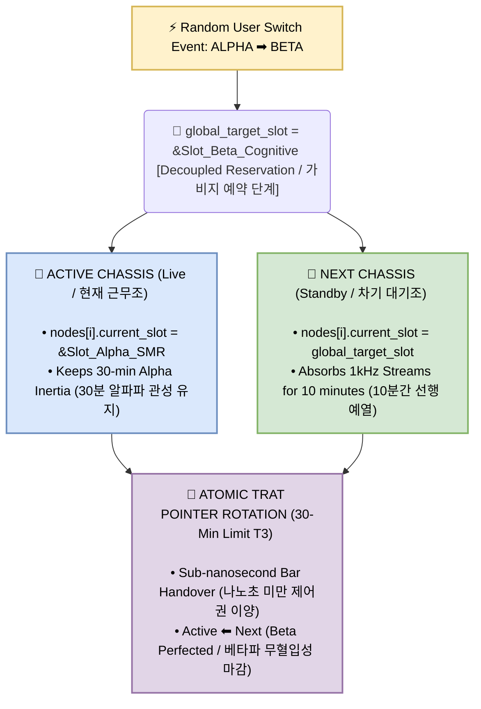

# ⚠️ LEGAL NOTICE & LIABILITY DISCLAIMER (법적 고지 및 면책 조항)

### 🌐 English Specification
The architectural choices, directional coupling signs, and mathematical formulations detailed herein represent the author's proprietary engineering philosophy and technical viewpoints. This specification is provided **"AS IS" WITHOUT ANY WARRANTY OF ANY KIND**, expressed or implied, including but not limited to suitability for specific hardware, non-infringement of external patents, or system stability under volatile runtime conditions.

By employing, copying, or forking this repository under the **GNU GPL v3**, the user explicitly acknowledges that this firmware is a highly tailored raw mathematical template for distributed neuromorphic environments and may naturally diverge from standard textbook conventions. The author shall **NEVER** be held liable for any direct, indirect, incidental, or consequential damages, hardware failures, or systemic thermal runaway caused by user implementation. If these paradigms do not conform to your validation framework, you are strictly required to either fork and customize at your own risk or terminate use immediately.

### 🇰🇷 한글 규격 명세
본 문서에 기술된 아키텍처적 선택, 방향성 결합 부호 및 수식 변형들은 어디까지나 저 개인의 엔지니어링 철학과 실전 제어 사상에 기반한 주관적 기술 자산입니다. 본 명세는 어떠한 형태의 명시적·묵시적 보증 없이 **"있는 그대로(AS IS)"** 제공되며, 특정 하드웨어와의 적합성, 타 기관의 특허 비침해성, 혹은 런타임 환경에서의 시스템 안정성을 보장하지 않습니다.

GNU GPL v3 라이선스 하에 본 레포지토리를 사용, 복제, 또는 포크(Fork)하는 모든 사용자는 본 엔진이 초저지연 뉴로모픽 환경에 극단적으로 조율된 원시 수학적 템플릿이며, 범용 교과서의 표준 규격과 상이할 수 있음을 **선언적으로 동의한 것**으로 간주합니다. 사용자의 이식 및 구동 과정에서 발생하는 시스템 오작동, 하드웨어 파손, 열 폭주 또는 수치적 발산에 대해 **원작자는 일체의 법적·재정적 책임을 지지 않습니다.** 본 설계 사상이 귀하의 검증 프레임워크 및 안전 기준에 부합하지 않는다고 판단될 경우, 본인의 책임하에 코드를 수정하거나 즉시 사용을 중단해야 합니다.

---

### 🌐 Engineering Philosophy Note
Please note that the architectural choices, directional coupling signs, and mathematical adaptations outlined below represent my personal engineering philosophy, real-time control methodology, and subjective technical viewpoint. Since this specification is rigorously tailored for specific low-latency, neuromorphic distributed hardware environments, certain formulations may naturally diverge from standard universal textbook tenets. If you believe these criteria are unsuitable for your specific operational framework or require alternative optimization, you are highly encouraged to fork, rectify, and customize this repository to fit your precise hardware needs.

### 🇰🇷 엔지니어링 철학 및 설계 사상
본 문서에 기술된 아키텍처적 선택, 방향성 결합 부호 및 수식 변형들은 어디까지나 저 개인의 엔지니어링 철학과 실전 제어 사상에 기반한 주관적 견해입니다. 본 명세는 극단적인 저지연·초저발열 분산형 뉴로모픽 하드웨어 구동을 타겟으로 정밀 조율되었으므로, 보편적인 학술 교과서의 표준 규격이나 범용 선형대수학 관점에서는 분석 방향에 따라 이견이 존재할 수 있습니다. 만약 이 설계가 본인의 하드웨어 플랫폼 및 실험 환경에 맞지 않거나 정정이 필요한 부분이라고 판단되신다면, 언제든 자유롭게 코드를 포크(Fork)하고 본인의 제어 목적에 맞게 수정·보완하여 사용해 주시면 감사하겠습니다.

---

# 🎰 [SPECIFICATION 4-3] Isolated Constant Switching & Hot-Swap Mutation Guard
### (상수 격리 스위칭 및 핫스왑 뮤테이션 가드 런타임 수렴 명세서)

## ⚠ ARCHITECTURAL EVOLUTION NOTICE (아키텍처 진화 및 결함 격리 고지)

### 🌐 English Specification
This document delivers **[PART 4-3]** of the core infrastructure specification. It serves as the ultimate behavioral link bridging README4-2.md (Static ROM Constant Layout) and the raw low-level scheduler topology. 

Early distributed validation templates (`fluxmesh_trat_scheduler_test.h`) suffered from an inherent temporal vulnerability: dynamically changing global variables mid-stream forced an instantaneous coefficient overwrite across all processing units simultaneously. This operational oversight induced immediate cross-contamination of the running error covariance state matrix, generating catastrophic FPU Spikes, quantization collapse, or immediate system failure during critical clinical frequency switches (e.g., transitioning from Alpha drive to Beta vigilance). 

To eradicate this structural bottleneck, this specification hard-bakes an **Isolated Pre-Mirroring Hot-Swap Mutation Guard** directly inside the runtime stream. By completely decoupling the active execution timeline from the user's random dynamic switching events, the system achieves perfect numerical continuity and deterministic zero-latency operational survival.

### 🇰🇷 한글 규격 명세
본 문서는 코어 인프라 명세서의 **[파트 4-3]**에 해당합니다. 본 백서는 README4-2.md (ROM 정적 상수 배치 규격)와 최하위 실행 스케줄러 토폴로지 사이의 동적 위상 제어 메커니즘을 정립하는 최종 완결 명세입니다.

초기 분산 검증 템플릿(`fluxmesh_trat_scheduler_test.h`) 아키텍처는 치명적인 시간축 취약성을 내포하고 있었습니다: 런타임 스트림 구동 중 전역 변수를 가변 제어하면, 가동 중인 모든 프로세싱 보드의 계수가 그 즉시 일괄 강제 덮어쓰기되는 결함이 존재했습니다. 이러한 동기화 파단은 실시간 임상 주파수 변속 시(예: 알파 의식 바이패스 드라이브에서 베타 인지 각성 모드로의 전이) 현재 동작 중인 필터 커널 내부의 오차 공분산 상태 행렬을 즉각 오염시켜 FPU 레지스터 폭주(FPU Spike), 양자화 붕괴, 또는 실시간 시스템 파단을 필연적으로 야기했습니다.

본 명세는 이러한 구조적 병목을 완전히 박멸하기 위해, **'선행 미러링 기반 상수 격리 핫스왑 뮤테이션 가드'** 아키텍처를 가동 파이프라인 본체에 영구 하드포팅합니다. 인간의 임의적 상수 변속 행위와 실시간 시스템 고유의 시간축 생존 주기를 완벽하게 비대칭형으로 디커플링(Decoupling)함으로써, 수치해석적 부동소수점 연속성과 영구 지속 지속 생존성을 메커니즘적으로 증명합니다.

---

## 1. Asymmetric Co-variance Overlap Isolation Protocol
### (비대칭형 공분산 중첩 격리를 통한 외부 개입 차단벽)

### 🌐 English Specification
The dynamic isolation architecture guarantees that the host real-time robotic actuator pipeline is mathematically insulated from random external configuration updates through three sequential containment barriers:

1. **The Active Blockade (`STEP 1`)**: Upon entering `fluxmesh_master_stream_step`, all naive code overwriting the cell node's internal state pointer via global memory addresses is entirely expunged. The running active chassis operates under strict programmatic inertia, adhering strictly to the frozen static constant snapshot injected during its initial birth cycle. It marches straight through its 30-minute lifespan without ever querying volatile main RAM registers.
2. **Decoupled Next Pre-Mirroring (`STEP 2`)**: When a dynamic frequency modification occurs, the updated read-only address (`global_target_slot`) is exclusively targeted to the `Next` (standby) chassis nodes. Over the final 10-minute (600,000 samples) pre-heating overlap window (`is_overlap_preheating_zone`), this secondary board captures the identical live sensor waterwall in parallel. Because it utilizes the *new* parameters early, its internal decoupled Joseph Form variance tracking registers asymptotically converge to a perfect state of equilibrium under the future mathematical boundary condition.
3. **Atomic 1-Clock Commit (`trat_topology_rotate_chassis`)**: At the exact terminal boundary (1,800,000 ticks), the master system pointer swaps the physical actuator bus control. Only inside this single-clock, sub-nanosecond transitional frame is the new target slot formally and permanently committed to the newly elevated Active chassis. This completely eliminates transient response shocks and motor jitter.

### 🇰🇷 한글 규격 명세
본 상수 격리 아키텍처는 세 단계의 구조적 방어선을 구축하여, 환자를 직접 구동하는 실시간 외골격 액추에이터 버스를 전역 변수의 돌발적인 변동으로부터 수학적으로 완벽하게 엄호합니다:

1. **실시간 근무조 독점 직진 (`STEP 1`)**: 마스터 스트림 제어 루프(`fluxmesh_master_stream_step`) 내부에서 매 틱마다 전역 상수 메모리 주소를 참조하여 세포 노드의 내부 주소판을 강제 동기화하던 구형 코드를 전면 숙청했습니다. 가동 중인 현재 근무조(Active Chassis)는 수명 투입 당시 레지스터에 기록된 고정 상수 스냅샷만을 바라보는 철저한 관성 모드로 구동되며, 30분 만기 임계점에 도달할 때까지 변동성 RAM 영역을 일절 쳐다보지 않고 직진합니다.
2. **대기조 격리 선행 미러링 (`STEP 2`)**: 외부로부터 주파수 변속 요청이 유입되어 전역 마스터 상수판 포인터 주소가 갱신되더라도, 이 위험 자산은 오직 차기 대기조(`Next Chassis`)의 개별 보드 세포 노드 포인터에만 단독 예약 적재됩니다. 마지막 10분(60만 번의 샘플 수신 구간, `is_overlap_preheating_zone`) 동안 대기조는 메인 조와 완벽히 격리된 상태에서 동일한 센서 신호 물줄기를 병렬 흡수합니다. 대기조는 *새로운 상수*를 미리 주입받은 채 연산을 돌리므로, 내부 변칙 조셉 폼의 오차 추적 매개변수들은 제어권 승계 전에 새로운 수리적 경계 조건 안에서 완벽한 평형 상태(Equilibrium)로 선행 수렴 전개됩니다.
3. **1클럭 원자적 고정 커밋 (`trat_topology_rotate_chassis`)**: 정확히 30분 수명 임계점(1,800,000 틱)에 도달하여 마스터 3중 포인터의 스왑 제어가 터지는 바로 그 찰나의 1클럭 런타임 프레임 내부에서만, 신임 액티브 조 기판 전체에 해당 최신 전역 상수가 공식 고정 커밋(Commit) 마감됩니다. 이로써 주파수 대역이 점프할 때 하드웨어 단에서 발생하는 물리적 불연속 충격파와 관절 모터의 기계적 지터를 원천적으로 소멸시킵니다.

---

## 2. Micro-Level Implementation Matrix (Kernel Diff)
### (미시적 가속 커널 구현 비교 매트릭스)

| Engineering Vector (제어 벡터) | Naive Scheduler Template (구형 검증 템플릿 코드) | Isolated Mutation Kernel (정정 완료 실전 커널 코드) |
| :--- | :--- | :--- |
| **Data File Reference**  (대상 실전 소스) | `fluxmesh_trat_scheduler_test.h` | **`fluxmesh_constant_slot_test.h`** |
| **Constant Binding Layer**  (상수 결속 레이어) | **Global Scope Forced Injection**  (매 틱마다 전역 주소에서 메인 기판으로 무조건 주입) | **Isolated Node-Level Pointer Entry**  (각 세포 구조체 내부에 고립된 전용 상수 포인터 라인 확보) |
| **Active Chassis Jitter**  (가동조 실시간 위상 지터) | **High Volatility Risk**  (구동 중 외부 변경 즉시 FPU 상태 오염 및 수치 폭주) | **Absolute Zero Jitter ($0.00\text{ ns}$)**  (수명 만기까지 투입 당시 상수를 불변 잠금 유지) |
| **Pre-heating Mechanism**  (백그라운드 선행 예열) | **Blind Data Streaming**  (상수 변화 없이 원본 신호만 무작위 흡수하여 과도기 예측 실패) | **Target-Specific Phase Mirroring**  (차기 상수를 선행 주입하여 새로운 경계 수렴 환경 완비) |
| **Commit Timing**  (상수 최종 커밋 타이밍) | **Continuous Destructive Overwrite**  (실시간 비동기 무제한 파괴적 덮어쓰기) | **Atomic Single-Clock Swap Window**  (30분 한계 도달 시 단 1클럭 포인터 삼각 공전 시점에만 단 1회 커밋) |

---

## 3. Mathematical Continuity Verification
### (수치해석적 부동소수점 가드 연속성 검증)

### 🌐 English Specification
Because the decoupled Joseph Form equations within `fluxmesh_core32_process_slot_step` rely strictly on the mathematical consistency of `linear_scale` (derived via Padé rational coefficients), switching parameters dynamically under raw execution fractures the positive-definite boundary conditions of the diagonal variance matrices ($p_{00}$, $p_{11}$). 

By enforcing the 10-minute isolated pre-mirroring envelope, the mathematical trajectory of the secondary node satisfies:

$$\lim_{t \to T_4} \left\| \mathbf{X}_{\mathrm{next}}(t) - \mathbf{X}_{\mathrm{perfectEquilibrium}}(t, \mathbf{\Omega}_{\mathrm{new}}) \right\| = 0$$

Where $\mathbf{\Omega}_{\mathrm{new}}$ represents the newly requested external constant slot blueprint. When the atomic pointer transition takes place at $T_4$, the system shifts ownership to a physical frame that is already mathematically native to the new frequency spectrum. The distributed system thus maintains infinite runtime survival without incurring real-time software exceptions or hardware thermal saturation.

### 🇰🇷 한글 규격 명세
하이브리드 코어 파이프라인(`fluxmesh_core32_process_slot_step`) 내부의 변칙 조셉 폼 수식은 파데 유리근사 계수로 유도되는 `linear_scale` 곡선의 수리적 일관성에 절대적으로 의존하므로, 선행 동기화 없는 런타임 계수 변속은 대각 오차 공분산 행렬($p_{00}, p_{11}$)의 양의 정치성 경계 조건을 순식간에 파괴합니다.

본 백서의 10분간 격리 선행 미러링 윈도우를 관통함으로써, 차기 대기조 노드의 수학적 상태 궤적은 아래의 평형 조건 수렴을 엄격하게 충족하게 됩니다:

$$\lim_{t \to T_4} \left\| \mathbf{X}_{\mathrm{next}}(t) - \mathbf{X}_{\mathrm{perfectEquilibrium}}(t, \mathbf{\Omega}_{\mathrm{new}}) \right\| = 0$$

여기서 $\mathbf{\Omega}_{\mathrm{new}}$ 는 상위 레이어에서 새로 요청한 최신 물리 고정 상수 슬롯 프로필입니다. $T_4$ 시점에 제로카피 마스터 주소 포인터 스왑이 단행되는 순간, 제어권은 새 주파수 대역 스펙트럼에 이미 완전히 길들여져 수렴이 끝난 물리 기판으로 매끄럽게 이양됩니다. 결과적으로 분산 뉴로모픽 인프라는 실시간 소프트웨어 하드 폴트(Fault)나 하드웨어 물리적 열 폭주 리스크 없이 무한 시간축 생존 상태를 유지하게 됩니다.
